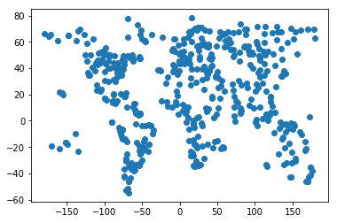
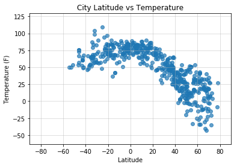
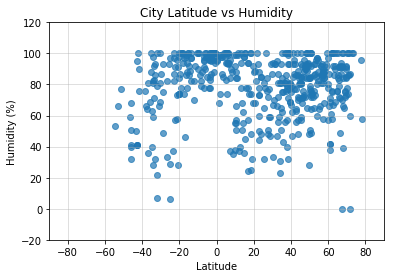
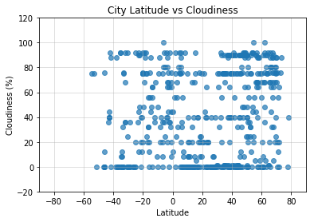
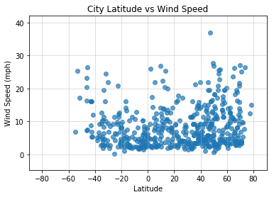

# WeatherPy

### Analysis

* In general, temperatures are highest in cities near the equator, and get lower as we move towards the two poles, especially in the north.
* Humidity seems especially high in cities near the equator to about -20 degrees latitude.
* Cloudiness and wind speed don't seem to have a coorelation with latitude.


```python
# Duty free imports
import pandas as pd
import random

import requests as req
import json

import matplotlib.pyplot as plt

from citipy import citipy
```


```python
# Get apikey
filename = "apikey.txt"

def get_file_contents(filename):
    try:
        with open(filename, "r") as file:
            return file.read().strip()
    except FileNotFoundError:
        print("'%s' file not found" % filename)
        
api_key = get_file_contents(filename)
```

## Generate Cities List & Perform API Calls

I'm generating cities and making API calls at the same time, because some generated cities may not get a successful API call. I'm generating cities untill we've made 500 successful API calls, not just generating 500 cities.


```python
# Make function to get random city
def get_rand_city():
    lat = random.randint(-90, 90)
    lng = random.randint(-180, 180)
    return citipy.nearest_city(lat, lng)
```


```python
# Set up the lists to record data
unique_list = [] # to prevent duplicates
name_list =[]
temp_list = []
hum_list = []
cloud_list = []
wind_list = []
lat_list = []
lng_list = [] # not needed, for testing only

# Get cities and weather info
while len(name_list) < 500:
    city = get_rand_city()
        
    if city.city_name not in unique_list:
        unique_list.append(city.city_name)
            
        try:
            req_url = "http://api.openweathermap.org/data/2.5/weather?" \
                    "appid=%s&q=%s&units=imperial" % (api_key, city.city_name)
            city_info = req.get(req_url).json()
            name_list.append("%s, %s" % (city_info["name"], city_info["sys"]["country"]))
            temp_list.append(city_info["main"]["temp"])
            hum_list.append(city_info["main"]["humidity"])
            cloud_list.append(city_info["clouds"]["all"])
            wind_list.append(city_info["wind"]["speed"])
            lat_list.append(city_info["coord"]["lat"])
            lng_list.append(city_info["coord"]["lon"])
            print(str(len(name_list)) + ": " + city_info["name"])
            
        except:
            pass

```

    1: Avarua
    2: Ribeira Grande
    3: Matelica
    4: Valvedditturai
    5: Saldanha
    6: Gat
    7: Krasnoarmeysk
    8: Tiksi
    9: Gamba
    10: Albany
    11: Atuona
    12: Hithadhoo
    13: Araioses
    14: Goderich
    15: Sorland
    16: Kapaa
    17: Santa Cruz del Sur
    18: Muros
    19: Klaksvik
    20: Saint Anthony
    21: Bonga
    22: Hilo
    23: Lorengau
    24: Barrow
    25: Tuktoyaktuk
    26: Jamestown
    27: Cape Town
    28: Nabire
    29: Kingsport
    30: Ushuaia
    31: Hobart
    32: Punta Arenas
    33: Cabo San Lucas
    34: East London
    35: Gillette
    36: Hermanus
    37: Kodiak
    38: Bluff
    39: Tukums
    40: Mataura
    41: Thompson
    42: Puerto Ayora
    43: Bredasdorp
    44: Storforshei
    45: Katsuura
    46: Busselton
    47: Luderitz
    48: Menongue
    49: Broome
    50: Seddon
    51: Qujing
    52: Faanui
    53: Lagoa
    54: Zhigalovo
    55: Mitchell
    56: Paamiut
    57: New Norfolk
    58: Mahibadhoo
    59: Mehamn
    60: Port Elizabeth
    61: Kirakira
    62: Abdanan
    63: Rikitea
    64: Carpentras
    65: Kruisfontein
    66: Mar del Plata
    67: Butaritari
    68: Jalu
    69: Yellowknife
    70: Carnarvon
    71: Georgetown
    72: Grand Gaube
    73: Vaini
    74: Galveston
    75: Maltahohe
    76: Salalah
    77: Kungurtug
    78: Avera
    79: Iqaluit
    80: Nome
    81: Birnin Kebbi
    82: Sabha
    83: Raudeberg
    84: Tazovskiy
    85: Kopychyntsi
    86: Ahipara
    87: Lata
    88: Khani
    89: Taltal
    90: Cherskiy
    91: Orotukan
    92: Merauke
    93: Saint-Augustin
    94: Mahebourg
    95: Cidreira
    96: Naze
    97: Lavrentiya
    98: Fort Frances
    99: Buta
    100: Cockburn Town
    101: Amapa
    102: Nikolskoye
    103: Rudsar
    104: Qaanaaq
    105: Torbay
    106: Richards Bay
    107: Kikwit
    108: Borba
    109: Pevek
    110: Kuching
    111: Ust-Ilimsk
    112: Antalaha
    113: Fairbanks
    114: Puno
    115: Port Alfred
    116: Hasaki
    117: Portsmouth
    118: Provideniya
    119: Sergeyevka
    120: Vestmanna
    121: Khatanga
    122: Ulaanbaatar
    123: Paraiso
    124: Pimentel
    125: Husavik
    126: Saint-Philippe
    127: Ranong
    128: Fukue
    129: Mirnyy
    130: Ponta do Sol
    131: Temirtau
    132: Chuy
    133: Ligayan
    134: San Vicente
    135: Adrar
    136: Esperance
    137: Hobyo
    138: Mount Hagen
    139: Oyo
    140: Brunico
    141: Souillac
    142: Upernavik
    143: Beringovskiy
    144: Cayenne
    145: Mokhsogollokh
    146: Doha
    147: Huarmey
    148: Uryupinsk
    149: Virden
    150: Sao Filipe
    151: Castro
    152: Oksfjord
    153: Bathsheba
    154: Berlevag
    155: San Rafael
    156: Saint George
    157: Comodoro Rivadavia
    158: Carlos Chagas
    159: Polyarnyy
    160: Alibag
    161: The Pas
    162: Alihe
    163: Morondava
    164: Durban
    165: Aquiraz
    166: Kabare
    167: Vidim
    168: Lebu
    169: Shingu
    170: Hami
    171: Soyo
    172: Kondinskoye
    173: Tuatapere
    174: Maniitsoq
    175: Halvad
    176: Kavaratti
    177: Tenenkou
    178: Campbell River
    179: Tadine
    180: Asosa
    181: Hulan
    182: Araouane
    183: Warren
    184: Batagay
    185: Puerto Baquerizo Moreno
    186: Rovereto
    187: Campbellton
    188: Haines Junction
    189: Atasu
    190: Kahului
    191: Bandar-e Lengeh
    192: Arraial do Cabo
    193: Keetmanshoop
    194: Povarovo
    195: Geraldton
    196: Alofi
    197: Vila Velha
    198: Linden
    199: Namibe
    200: Ergani
    201: Yinchuan
    202: Saint-Pierre
    203: Weligama
    204: Hede
    205: Camacha
    206: Cap Malheureux
    207: Nanortalik
    208: La Union
    209: Elko
    210: Toora-Khem
    211: Fortuna
    212: Egvekinot
    213: Chumikan
    214: Rathdrum
    215: Tual
    216: Westport
    217: Hambantota
    218: Saskylakh
    219: Tromso
    220: Hokitika
    221: Itoman
    222: Camocim
    223: Sehithwa
    224: Saposoa
    225: Rundu
    226: Tucurui
    227: Davila
    228: Iskateley
    229: Taoudenni
    230: Jizan
    231: Verkhnyaya Inta
    232: Ostrovnoy
    233: Pandan Niog
    234: Kristiansand
    235: Bandarbeyla
    236: Juba
    237: Sitka
    238: Dikson
    239: Turukhansk
    240: Rawson
    241: Constitucion
    242: Mwinilunga
    243: Severo-Kurilsk
    244: Picota
    245: Parfino
    246: Manokwari
    247: Pemberton
    248: Sur
    249: Norman Wells
    250: Lima
    251: Navahrudak
    252: Las Palmas
    253: Havoysund
    254: Kjopsvik
    255: Portland
    256: Bambous Virieux
    257: Tasiilaq
    258: Two Rivers
    259: Port-Gentil
    260: Sioux Lookout
    261: Sira
    262: Kirchzarten
    263: Madona
    264: Sarkand
    265: Pundaguitan
    266: San Jeronimo
    267: Mamaku
    268: Mabaruma
    269: Isla Vista
    270: Rutana
    271: Srednekolymsk
    272: Borujerd
    273: Bay Roberts
    274: Yar-Sale
    275: Broken Hill
    276: Sovetskiy
    277: Inongo
    278: Maceio
    279: Rio Gallegos
    280: Nizhniy Ufaley
    281: Ternate
    282: Balaipungut
    283: Chicama
    284: Carora
    285: Quelimane
    286: Nishihara
    287: Acapulco
    288: Nyagan
    289: Simao
    290: Aswan
    291: Okhotsk
    292: Mount Isa
    293: Erenhot
    294: Kutahya
    295: Lander
    296: Kouroussa
    297: Danshui
    298: Bethel
    299: Longyearbyen
    300: Bara
    301: Ovalle
    302: Ferme-Neuve
    303: Buala
    304: Urucara
    305: Orlovskiy
    306: Victoria
    307: Cairns
    308: Mandalgovi
    309: Gorin
    310: Hovd
    311: Airai
    312: San Quintin
    313: Bukachacha
    314: Nhulunbuy
    315: Iracoubo
    316: Isaka
    317: Mbandaka
    318: Dudinka
    319: Huilong
    320: Kaitangata
    321: Ceahlau
    322: Vostok
    323: Kolarovo
    324: Talas
    325: Seredka
    326: Hengshui
    327: General Pico
    328: Kaeo
    329: Los Llanos de Aridane
    330: Boddam
    331: Dickinson
    332: Khandagayty
    333: Mahajanga
    334: Sola
    335: Vallenar
    336: Zlitan
    337: Sinnamary
    338: Vung Tau
    339: Rio Tercero
    340: Wagar
    341: Dubbo
    342: Gonda
    343: Rosetta
    344: Alyangula
    345: Vanimo
    346: Ubauro
    347: Pacific Grove
    348: Ahuimanu
    349: Erzin
    350: Laguna
    351: Balila
    352: Kavieng
    353: Mvuma
    354: Harper
    355: Leningradskiy
    356: Udachnyy
    357: Billings
    358: Havelock
    359: Morro Bay
    360: Novobirilyussy
    361: Ilulissat
    362: Abu Samrah
    363: Margate
    364: Xichang
    365: Dunedin
    366: Qaqortoq
    367: College
    368: Bure
    369: Morehead
    370: Mercedes
    371: Lanigan
    372: Paita
    373: Yima
    374: Fort Nelson
    375: Lompoc
    376: Zhigansk
    377: Talcahuano
    378: Puerto Escondido
    379: Chute-aux-Outardes
    380: Amantea
    381: Dingle
    382: Cedar City
    383: Tecoanapa
    384: Baiyin
    385: Komsomolskiy
    386: Batagay-Alyta
    387: Camapua
    388: Havre-Saint-Pierre
    389: Pervomayskoye
    390: Ancud
    391: Tarakan
    392: Cap-aux-Meules
    393: Nizhniy Chir
    394: Luganville
    395: Skjervoy
    396: Pyshma
    397: Pocone
    398: Bonavista
    399: Linjiang
    400: Teacapan
    401: Padang
    402: Yulara
    403: Jacmel
    404: Sosnovo-Ozerskoye
    405: Rypefjord
    406: Praia da Vitoria
    407: Aklavik
    408: Chokurdakh
    409: Talnakh
    410: Dovers
    411: Rafsanjan
    412: Guaraniacu
    413: Narsaq
    414: Hanzhong
    415: Coquimbo
    416: Chapais
    417: Almaznyy
    418: Aksay
    419: Willmar
    420: Felipe Carrillo Puerto
    421: Usinsk
    422: Grand-Santi
    423: Devrek
    424: Vila
    425: Bumba
    426: Plettenberg Bay
    427: Faya
    428: Grindavik
    429: Tura
    430: Tautira
    431: Kandrian
    432: Les Cayes
    433: Solenzo
    434: Darhan
    435: Vardo
    436: Posse
    437: Bubaque
    438: Namatanai
    439: Klyuchi
    440: Aksha
    441: Cambara
    442: Cabedelo
    443: Esfahan
    444: Yaan
    445: Ryotsu
    446: Tulum
    447: Fare
    448: Bastia
    449: Matara
    450: Wilmington
    451: Saint-Leu
    452: Shakawe
    453: Artvin
    454: Codrington
    455: Antigonish
    456: San Ramon
    457: Ballina
    458: Celendin
    459: Iralaya
    460: Belyy Yar
    461: Mogadishu
    462: Bitam
    463: Kalmunai
    464: Varhaug
    465: Peleduy
    466: Takoradi
    467: Bataipora
    468: Saint-Joseph
    469: Kautokeino
    470: Bontang
    471: Sawtell
    472: Walvis Bay
    473: Cardoso
    474: Rosetown
    475: Torzhok
    476: Vila Franca do Campo
    477: Poltavka
    478: Uch
    479: Lumby
    480: Tandil
    481: Balgazyn
    482: Port Blair
    483: Panama City
    484: Pisco
    485: Nador
    486: Yumen
    487: Vanavara
    488: Polunochnoye
    489: Synya
    490: Borovoy
    491: Den Helder
    492: Taguatinga
    493: Rio Grande
    494: Pathein
    495: Killybegs
    496: Grenville
    497: Santa Rosa
    498: Noumea
    499: Cleveland
    500: Lahat
    


```python
# Make the dataframe
weather_df = pd.DataFrame({
    "City": name_list,
    "Temperature": temp_list,
    "Humidity": hum_list,
    "Cloudiness": cloud_list,
    "Wind Speed": wind_list,
    "Latitude": lat_list,
    "Longitude": lng_list
})

# Export it to CSV
weather_df.to_csv("weather_data.csv")

# Visually inspect dataframe
weather_df.head()
```


<div>
<style>
    .dataframe thead tr:only-child th {
        text-align: right;
    }

    .dataframe thead th {
        text-align: left;
    }

    .dataframe tbody tr th {
        vertical-align: top;
    }
</style>
<table border="1" class="dataframe">
  <thead>
    <tr style="text-align: right;">
      <th></th>
      <th>City</th>
      <th>Cloudiness</th>
      <th>Humidity</th>
      <th>Latitude</th>
      <th>Longitude</th>
      <th>Temperature</th>
      <th>Wind Speed</th>
    </tr>
  </thead>
  <tbody>
    <tr>
      <th>0</th>
      <td>Avarua, CK</td>
      <td>40</td>
      <td>73</td>
      <td>-21.21</td>
      <td>-159.78</td>
      <td>75.20</td>
      <td>3.36</td>
    </tr>
    <tr>
      <th>1</th>
      <td>Ribeira Grande, PT</td>
      <td>64</td>
      <td>99</td>
      <td>38.52</td>
      <td>-28.70</td>
      <td>64.81</td>
      <td>14.90</td>
    </tr>
    <tr>
      <th>2</th>
      <td>Matelica, IT</td>
      <td>0</td>
      <td>100</td>
      <td>43.26</td>
      <td>13.01</td>
      <td>29.43</td>
      <td>2.24</td>
    </tr>
    <tr>
      <th>3</th>
      <td>Valvedditturai, LK</td>
      <td>0</td>
      <td>92</td>
      <td>9.82</td>
      <td>80.17</td>
      <td>81.46</td>
      <td>14.12</td>
    </tr>
    <tr>
      <th>4</th>
      <td>Saldanha, PT</td>
      <td>0</td>
      <td>87</td>
      <td>41.42</td>
      <td>-6.55</td>
      <td>20.26</td>
      <td>2.59</td>
    </tr>
  </tbody>
</table>
</div>


```python
# Check to make sure that there are 500 unique cities here
weather_df["City"].nunique()
```


    500


```python
# Test the locations to see if we've covered everywhere
plt.scatter(lng_list, lat_list)
plt.show()
```





## Latitude vs Temperature Plot


```python
# Make the Temperature vs Latitude plot
# Make figure for saving
fig = plt.figure()

# Plot the data
plt.scatter(weather_df.Latitude, weather_df.Temperature, alpha=0.7)

# Present the axes
plt.grid(alpha=0.5)
plt.xlim(-90, 90)
plt.ylim(min(weather_df.Temperature)-20, max(weather_df.Temperature)+20)

# Title & label
plt.title("City Latitude vs Temperature")
plt.xlabel("Latitude")
plt.ylabel("Temperature (F)")

# Save the image
fig.savefig("lat_v_temp.png")

# Show it
plt.show()
```





## Latitude vs Humidity Plot


```python
# Make the Humidity vs Latitude plot
# Make figure for saving
fig = plt.figure()

# Plot the data
plt.scatter(weather_df.Latitude, weather_df.Humidity, alpha=0.7)

# Present the axes
plt.grid(alpha=0.5)
plt.xlim(-90, 90)
plt.ylim(min(weather_df.Humidity)-20, max(weather_df.Humidity)+20)

# Title & label
plt.title("City Latitude vs Humidity")
plt.xlabel("Latitude")
plt.ylabel("Humidity (%)")

# Save the image
fig.savefig("lat_v_hum.png")

# Show it
plt.show()
```





## Latitude vs Cloudiness Plot


```python
# Make the Cloudiness vs Latitude plot
# Make figure for saving
fig = plt.figure()

# Plot the data
plt.scatter(weather_df.Latitude, weather_df.Cloudiness, alpha=0.7)

# Present the axes
plt.grid(alpha=0.5)
plt.xlim(-90, 90)
plt.ylim(min(weather_df.Cloudiness)-20, max(weather_df.Cloudiness)+20)

# Title & label
plt.title("City Latitude vs Cloudiness")
plt.xlabel("Latitude")
plt.ylabel("Cloudiness (%)")

# Save the image
fig.savefig("lat_v_cloud.png")

# Show it
plt.show()
```





## Latitude vs Wind Speed Plot


```python
# Make the Wind Speed vs Latitude plot
# Make figure for saving
fig = plt.figure()

# Plot the data
plt.scatter(weather_df.Latitude, weather_df["Wind Speed"], alpha=0.7)

# Present the axes
plt.grid(alpha=0.5)
plt.xlim(-90, 90)
plt.ylim(min(weather_df["Wind Speed"])-5, max(weather_df["Wind Speed"])+5)

# Title & label
plt.title("City Latitude vs Wind Speed")
plt.xlabel("Latitude")
plt.ylabel("Wind Speed (mph)")

# Save the image
fig.savefig("lat_v_wind.png")

# Show it
plt.show()
```




